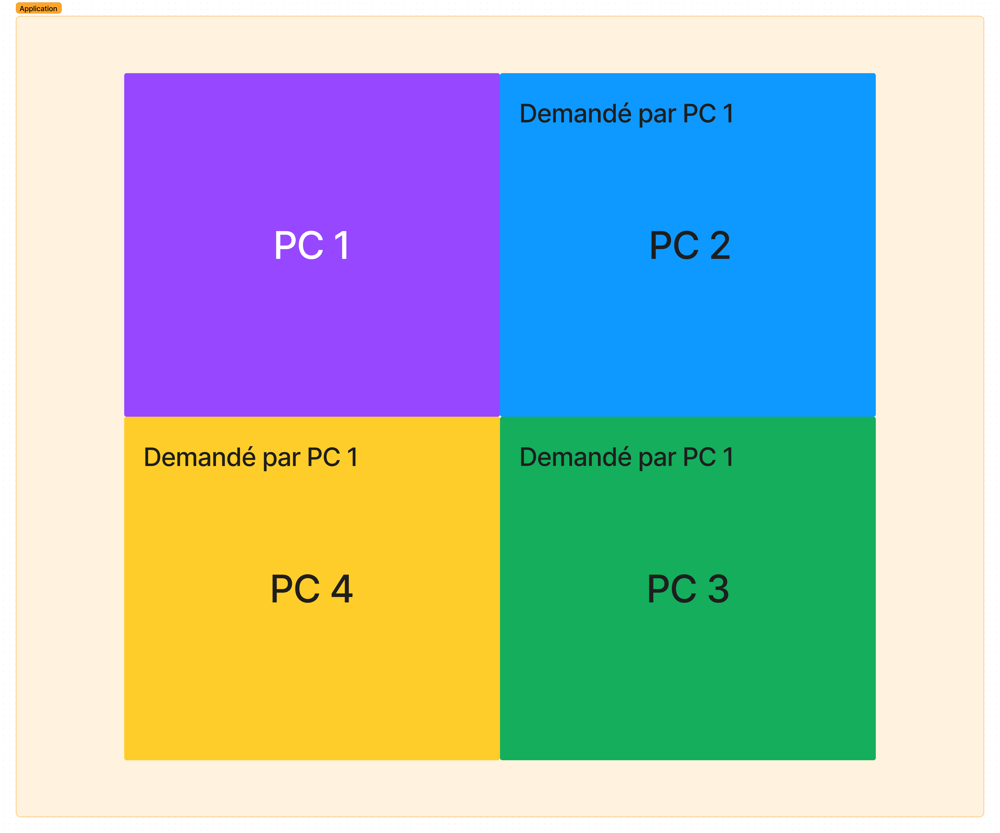
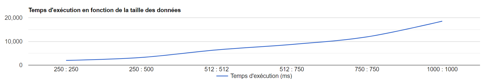
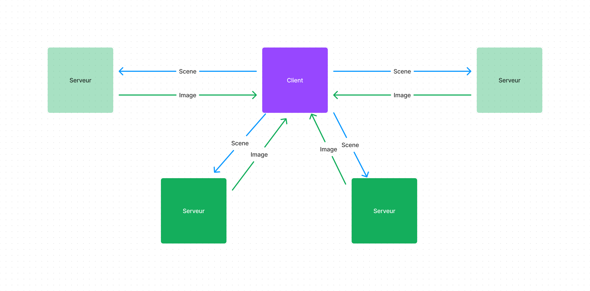

# S4RAIL2_PROJET_CALCUL_PARALLELE

## Questions
### En utilisant votre meilleur outil, votre imagination, décrivez et illustrez comment cela pourrait être réalisé, sans rentrer dans les détails JAVA, que vous n'allez pas tarder à mettre en œuvre.

Pour réaliser, ce projet qui est de répartir les taches de calculs sur plusieurs machines pour la création d'une image raytracing.
L'image sera divisée en plusieurs parties, qui seront calculées par les machines.
Par exemple, si on a 4 machines, l'image sera divisée en 4 parties, qui seront calculées par les machines. Puis les machines enverront les résultats à la machine principale qui va les assembler pour créer l'image finale.

#### Explication des étapes lors de la création de l'image :
- L'utilisateur lance le programme sur la machine principale.
- Le programme va diviser l'image en plusieurs parties.
- Le programme va envoyer les parties aux différentes machines.
- Les machines vont calculer les parties de l'image.
- Les machines vont envoyer les résultats à la machine principale.
- La machine principale va assembler les résultats pour créer l'image finale.
- L'image finale est affichée à l'utilisateur.

Voici un schéma qui illustre le fonctionnement du programme :

### Tester le programme en modifiant ses paramètres (sur la ligne de commande).
### Observer le temps de d'exécution en fonction de la taille de l'image calculée. Vous pouvez faire une courbe (temps de calcul et tailles d'image).

### Faire un petit schéma de cette architecture

### Si on veux que les calculs se fassent en parallèle que faut-il faire ?

Pour que les calculs se fassent en parallèle, on doit utiliser le multithreading. Grâce au multithreading, on peut exécuter plusieurs tâches en même temps. Dans notre cas, on peut exécuter plusieurs calculs en même temps sur des machines différentes. Ici le client crée des threads qui demande aux "Serveurs" de calculer une partie de l'image. Les serveurs vont calculer les parties de l'image en parallèle. Puis les serveurs vont envoyer les résultats à la machine principale qui va les assembler pour créer l'image finale.
